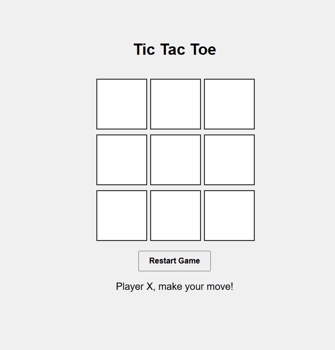

# ❌⭕ Tic-Tac-Toe Game

A simple yet fun **Tic-Tac-Toe** (also known as Noughts and Crosses) game built with **HTML**, **CSS**, and **JavaScript**. Challenge a friend or test your luck in this classic two-player grid game — styled with a clean, modern UI and dynamic gameplay.

 <!-- Replace with actual path if available -->

---

## 🎮 Features

- 🔁 Two-player local gameplay (X vs. O)
- 🧠 Game logic for win, lose, and draw detection
- 📦 Clean 3×3 grid layout using Flexbox or CSS Grid
- 🎨 Highlight winning combinations
- 🔄 "Play Again" or "Reset Game" functionality
- ⚙️ Pure HTML, CSS & vanilla JavaScript (no frameworks)

---

## 📁 Project Structure
```
tic-tac-toe/
├── index.html # Game board and UI structure
├── css/
│ └── style.css # Styling for layout and animations
├── js/
│ └── script.js # Game logic (turns, win checks, reset)
├── screenshot.png # Screenshot for demo purposes
```
